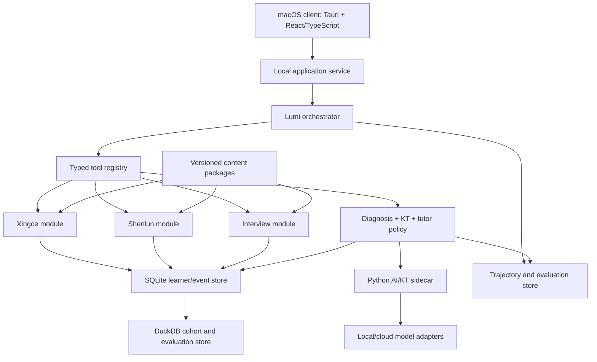

# Lumi v0 architecture

## System shape

Lumi uses a local macOS shell, a typed application layer, and an AI/analytics
sidecar. The architecture is a modular monolith for v0: process boundaries are
clear, but premature distributed services are avoided.



## Technology decision

- Tauri 2 provides the macOS app shell, native permissions, updates later, and a
  smaller footprint than Electron.
- React and TypeScript implement the Codex-inspired multi-pane UI and typed
  application state.
- Rust owns privileged local operations, sidecar lifecycle, and a narrow command
  surface. It is not the home for rapidly changing learning research.
- Python owns KT experiments, statistical inference, embeddings where needed,
  and evaluation jobs behind a versioned local protocol.
- SQLite is authoritative for transactional learner state and event history.
- DuckDB reads immutable/exported events for cohort priors, offline experiments,
  dashboards, and model comparisons.

## UI information architecture

Borrow the density and inspectability of the Codex desktop client without cloning
branding:

- Left rail: goals, Today, sessions, skill map, error dossier, and Agent Lab.
- Main pane: current practice, response editor, rubric, or tutor conversation.
- Right inspector: evidence, active hypotheses, mastery delta, plan, and tool
  activity. It is collapsible during focused practice.
- Bottom activity area: live run status, local/cloud indicator, latency, errors,
  and background evaluation tasks.
- Command palette: start practice, inspect a skill, replay a trajectory, import a
  package, or switch provider.

Use progressive disclosure: learners see concise coaching; reviewers can expand
the exact evidence and machine-readable state in Agent Lab.

## Agent runtime

The orchestrator is a durable state machine, not an unbounded autonomous loop:

```text
IDLE → OBSERVE → DIAGNOSE → SELECT_ACTION → EXECUTE
     → VERIFY → UPDATE_STATE → SCHEDULE → REFLECT → IDLE
```

Every transition has typed input/output, a retry budget, timeout, cancellation,
and an explicit failure state. Tool calls are idempotent where possible. State
updates use optimistic concurrency and an append-only event before materialized
views are changed.

The runtime borrows useful modern-agent patterns:

- structured tools and outputs rather than prompt-parsed prose;
- handoffs to domain specialists while one orchestrator retains ownership;
- input/output guardrails and evaluator checks;
- resumable sessions, human approval points, and background jobs;
- trace spans for prompts, tools, model calls, policies, and state deltas;
- skills/playbooks as versioned teaching procedures;
- memory tiers with explicit promotion and expiry rules.

## Memory and state

Separate four kinds of memory:

1. Event memory: immutable attempts, edits, hints, timing, transcripts, probes.
2. Learner model: computed mastery distributions, misconceptions, preferences,
   fatigue/context signals, and review schedule.
3. Episodic summaries: compact session summaries linked to source events.
4. Agent working memory: temporary context with a short lifetime.

Only event memory is evidence. Computed states are rebuildable projections with
model and schema versions. Natural-language summaries cannot directly change
mastery.

## Shared learning contract

Domain modules emit a common envelope while retaining domain-specific payloads:

```json
{
  "event_id": "uuid",
  "learner_id": "local-user",
  "domain": "xingce|shenlun|interview",
  "content_ref": {"package": "...", "item": "...", "version": "..."},
  "observations": [],
  "skill_evidence": [],
  "diagnosis_hypotheses": [],
  "intervention": null,
  "verification": null,
  "provenance": {"producer": "...", "model": "...", "policy": "..."},
  "occurred_at": "RFC3339"
}
```

Important entities include skills and edges, content-skill links (the Q-matrix),
attempts and attempt events, hypotheses and evidence, interventions, mastery
snapshots/history, review schedules, cohort-prior versions, trajectories, and
evaluation runs.

## Diagnosis and KT

Diagnosis combines:

```text
P(cause | evidence, learner, cohort, content)
∝ likelihood(evidence | cause)
  × cohort prior(cause | subtype, distractor, ability band)
  × learner prior(cause | history, prerequisite state)
```

The cause taxonomy is subtype-specific. “Careless” is not an acceptable terminal
cause without an observable operational definition such as unit omission after a
correct intermediate result.

KT v0 is an ensemble research layer with an interpretable production default:

- BKT/PFA-style per-skill state and forgetting for the initial online update;
- IRT-style item difficulty/discrimination estimates when data permits;
- graph propagation bounded by prerequisite/evidence weights;
- optional AKT/SAINT-like sequence models only after sufficient trajectories;
- calibrated ensemble output containing mastery, uncertainty, evidence count,
  forgetting risk, and model disagreement.

Model outputs propose state deltas. A deterministic update service validates
ranges, evidence links, version compatibility, and rollback/rebuild behavior.

## Tutor policy

The policy selects among ask, hint, worked example, micro-lesson, isomorphic item,
transfer item, spaced review, or stop/rest. v0 uses explicit rules plus expected
information gain. Logged trajectories later support contextual-bandit experiments
and offline policy evaluation; online reinforcement learning is out of scope.

## Model routing policy

Route by consequence, reasoning complexity, uncertainty, and available verifier;
do not use one expensive model for every step:

- Strong reasoning model: ambiguous multi-skill diagnosis, long-form Shenlun or
  Interview evidence synthesis, high-impact teaching plans, judge disagreement,
  safety/privacy decisions, and release-candidate policy review.
- Balanced model: routine structured tutoring, content transformation, ordinary
  evidence extraction, implementation assistance, and well-specified workflows.
- Light/local model: classification, summarization, formatting, retrieval query
  generation, and low-risk UI assistance where outputs are cheaply verifiable.
- Deterministic code: scoring, schema/range validation, KT state application,
  permissions, package verification, scheduling invariants, and state rebuild.

A light-model result cannot independently create a high-impact diagnosis,
teaching decision, or learner-state change. It must pass a deterministic verifier
when one exists, otherwise receive strong-model review. Routing records task risk,
selected tier, reason, verifier, fallback, latency, and cost. Escalate on low
confidence, out-of-distribution input, missing evidence, or model disagreement;
degrade to abstention rather than silently accepting an unverifiable result.

## Content boundary

Lumi accepts two versioned content paths. `xingcetiku` may publish immutable
packages with a manifest, schema version, checksums, canonical items, paper
occurrences, assets, skills, and distractor annotations. Separately, the
internal Core-320 bank is reproduced from repository-owned deterministic module
generators and a frozen manifest digest. Both paths fail closed on schema,
count, oracle, or checksum mismatch; neither path queries mutable source folders
at runtime. The generated path commits schemas, generators, checksums, and safe
samples rather than the 320-item bulk materialization.

Shenlun production remains read-only. Lumi builds an independent domain module
from documented requirements, owned test fixtures, and explicit import contracts.

## Privacy, safety, and offline degradation

- Default storage is local and encryptable; secrets use macOS Keychain.
- Logs redact response content and personal data by schema, not string guessing.
- Cloud providers are opt-in per capability and display the data boundary before
  first use. A no-cloud mode must remain available.
- Offline deterministic scoring, content retrieval, learner history, baseline KT,
  and scheduling continue to work. Generative coaching may use a local model or a
  constrained template fallback.
- Audio retention is separately configurable; transcripts and extracted evidence
  can be retained without keeping raw recordings.

## Observability

Each trajectory includes correlation IDs and spans for user event, policy choice,
retrieval, prompt construction, model response, verifier result, tool call,
database update, and evaluation. The Agent Lab supports timeline, state diff,
JSON export, replay in dry-run mode, and comparison across policy/model versions.
