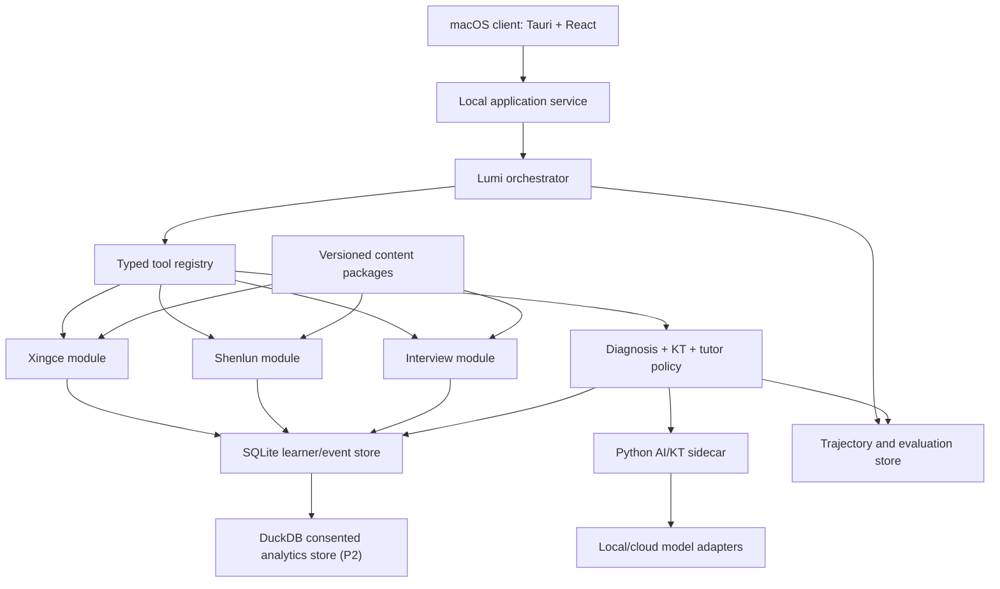

# Lumi target architecture and implemented P0.1 slice

This document is the architectural direction, not a claim that every box is
already implemented. The current executable slice is deliberately smaller:

| Capability | Current status |
| --- | --- |
| Tauri + React Mac client, loopback Python sidecar, SQLite hash-chained trace and immutable content snapshots | implemented in P0.1 |
| Real first answer → targeted probe → cause-specific teaching → independent verification → per-run KT update | implemented for one visible Xingce path; deterministic representative contracts cover Xingce, Shenlun, and Interview |
| Six-level authored assistance and event-sourced misconception dossier | implemented in P0.1; policies are synthetic and uncalibrated |
| Today plan and independent ReviewSchedule | planned P0.2 |
| Study Pack and Shenlun process coach | planned P0.3/P0.4 |
| Durable jobs, registries, confirmed memory, longitudinal KT, bounded background workers | planned P1 |
| Consented event flywheel, DuckDB analytics, delayed-retention evaluation, coach view, eligible cohort priors | planned P2 |

The current client is JavaScript/React rather than TypeScript. There is no
DuckDB store, Agent Lab, Keychain integration, longitudinal learner model,
durable job system, or background scheduler yet.

## System shape

The target is a local macOS modular monolith with explicit application, agent,
domain, learning, and analytics boundaries. P0.1 currently instantiates the UI,
loopback sidecar, deterministic learning packages, and SQLite trace portion.



## Technology direction

- Tauri 2 provides the macOS app shell, native permissions, updates later, and a
  smaller footprint than Electron.
- React currently implements the Khanmigo-grounded multi-pane UI. TypeScript is
  a possible later migration, not a present capability.
- Rust owns privileged local operations, sidecar lifecycle, and a narrow command
  surface. It is not the home for rapidly changing learning research.
- Python owns KT experiments, statistical inference, embeddings where needed,
  and evaluation jobs behind a versioned local protocol.
- SQLite currently owns append-only per-run events and immutable content
  snapshots. Authoritative longitudinal learner state is P1 work.
- DuckDB ingestion, consent lineage, cohort priors, dashboards, and model
  comparisons are P2 work.

## Target UI information architecture

Borrow the density and inspectability of the Codex desktop client without cloning
branding:

- Left rail: goals, Today, sessions, skill map, error dossier, and Agent Lab.
- Main pane: current practice, response editor, rubric, or tutor conversation.
- Right inspector: evidence, active hypotheses, mastery delta, plan, and tool
  activity. It is collapsible during focused practice.
- Bottom activity area: live run status, local/cloud indicator, latency, errors,
  and background evaluation tasks.
- Command palette: start practice, inspect a skill, replay a trajectory, import a
  package, or switch provider.

P0.1 implements Today, disabled future-task surfaces, one real training tool,
and an evidence-only skill report. Agent Lab and the broader navigation above
remain future product surfaces.

## Agent runtime: current boundary and P1 target

The current runtime is a bounded, append-only phase machine with interrupt and
resume at learner-response boundaries. It is not crash-recoverable durable-job
infrastructure. The P1 target is:

```text
IDLE → OBSERVE → DIAGNOSE → SELECT_ACTION → EXECUTE
     → VERIFY → UPDATE_STATE → SCHEDULE → REFLECT → IDLE
```

P0.1 has versioned inputs/outputs, SQLite compare-and-append, explicit failure
states, and idempotent assistance commands. Retry budgets, cancellation,
leases/fencing, checkpoint recovery, and general command-result idempotency are
P1 requirements.

The runtime borrows useful modern-agent patterns:

- structured tools and outputs rather than prompt-parsed prose;
- handoffs to domain specialists while one orchestrator retains ownership;
- input/output guardrails and evaluator checks;
- resumable sessions, human approval points, and background jobs;
- trace spans for prompts, tools, model calls, policies, and state deltas;
- skills/playbooks as versioned teaching procedures;
- memory tiers with explicit promotion and expiry rules.

## Target memory and state

The target separates four kinds of memory:

1. Event memory: immutable attempts, edits, hints, timing, transcripts, probes.
2. Learner model: computed mastery distributions, misconceptions, preferences,
   fatigue/context signals, and review schedule.
3. Episodic summaries: compact session summaries linked to source events.
4. Agent working memory: temporary context with a short lifetime.

P0.1 implements the event trace and rebuildable per-run projections only. It has
no confirmed preference-memory store or authoritative longitudinal KT state.
Natural-language summaries cannot directly change mastery.

## Shared learning contract

Domain modules emit a common envelope while retaining domain-specific payloads:

```json
{
  "event_id": "uuid",
  "learner_id": "local-user",
  "domain": "xingce|shenlun|interview",
  "content_ref": {"package": "...", "item": "...", "version": "..."},
  "observations": [],
  "skill_evidence": [],
  "diagnosis_hypotheses": [],
  "intervention": null,
  "verification": null,
  "provenance": {"producer": "...", "model": "...", "policy": "..."},
  "occurred_at": "RFC3339"
}
```

Important entities include skills and edges, content-skill links (the Q-matrix),
attempts and attempt events, hypotheses and evidence, interventions, mastery
snapshots/history, review schedules, cohort-prior versions, trajectories, and
evaluation runs.

## Diagnosis and KT

Diagnosis combines:

```text
P(cause | evidence, learner, prior, content)
∝ likelihood(evidence | cause)
  × versioned prior(cause | subtype, distractor)
  × learner prior(cause | history, prerequisite state)
```

The cause taxonomy is subtype-specific. “Careless” is not an acceptable terminal
cause without an observable operational definition such as unit omission after a
correct intermediate result.

Current P0.1 KT is a deterministic per-run BKT/PFA/Rasch-style baseline. The
following is the broader research target:

- BKT/PFA-style per-skill state and forgetting for the initial online update;
- IRT-style item difficulty/discrimination estimates when data permits;
- graph propagation bounded by prerequisite/evidence weights;
- optional AKT/SAINT-like sequence models only after sufficient trajectories;
- calibrated ensemble output containing mastery, uncertainty, evidence count,
  forgetting risk, and model disagreement.

Model outputs propose state deltas. A deterministic update service validates
ranges, evidence links, version compatibility, and rollback/rebuild behavior.

## Tutor policy

P0.1 implements an authored six-level assistance ladder, targeted probe,
cause-specific teaching variant, and independent transfer item. Expected-
information-gain selection, spaced review, contextual-bandit experiments, and
offline policy evaluation are future work; online reinforcement learning is out
of scope.

## Model routing policy

Route by consequence, reasoning complexity, uncertainty, and available verifier;
do not use one expensive model for every step:

- Strong reasoning model: ambiguous multi-skill diagnosis, long-form Shenlun or
  Interview evidence synthesis, high-impact teaching plans, judge disagreement,
  safety/privacy decisions, and release-candidate policy review.
- Balanced model: routine structured tutoring, content transformation, ordinary
  evidence extraction, implementation assistance, and well-specified workflows.
- Light/local model: classification, summarization, formatting, retrieval query
  generation, and low-risk UI assistance where outputs are cheaply verifiable.
- Deterministic code: scoring, schema/range validation, KT state application,
  permissions, package verification, scheduling invariants, and state rebuild.

A light-model result cannot independently create a high-impact diagnosis,
teaching decision, or learner-state change. It must pass a deterministic verifier
when one exists, otherwise receive strong-model review. Routing records task risk,
selected tier, reason, verifier, fallback, latency, and cost. Escalate on low
confidence, out-of-distribution input, missing evidence, or model disagreement;
degrade to abstention rather than silently accepting an unverifiable result.

## Content boundary

`xingcetiku` publishes immutable packages with a manifest, schema version,
checksums, canonical items, paper occurrences, assets, skills, and distractor/
misconception annotations. Lumi imports packages through validation and never
queries mutable source folders directly.

Shenlun production remains read-only. Lumi builds an independent domain module
from documented requirements, owned test fixtures, and explicit import contracts.

## Privacy, safety, and offline degradation

- P0.1 storage and scoring are local; the sidecar binds only to loopback and the
  packaged app manages its lifecycle.
- P0.1 minimizes persisted learner responses and applies versioned redaction for
  common PII and secret forms. It does not claim comprehensive schema-driven
  privacy classification.
- No cloud provider is enabled in the P0.1 path.
- Keychain-backed secrets, encrypted stores, cloud-consent UX, audio retention,
  local generative models, and offline scheduling are future capabilities.

## Observability

P0.1 records append-only events, tool/state artifacts, model/policy versions,
hash verification, and replay. A reviewer can inspect JSON through the local
service and release reports. Timeline UI, state-diff explorer, export controls,
and cross-policy comparison in an Agent Lab are future work.
