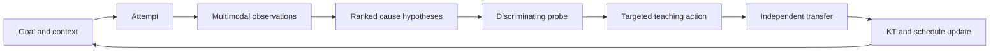
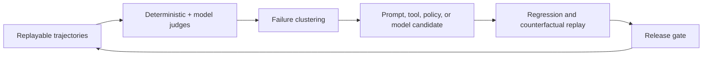

# Lumi learning loops

Lumi has three coupled feedback loops. A feature is not “agentic” merely because
it invokes a model; it must sense state, choose a bounded action, observe the
outcome, and revise future behavior.

## Loop 1: learner improvement



### Required decisions

1. Observe facts: response, time, changes, confidence, hints, process evidence,
   rubric evidence, speech features, and context.
2. Generate subtype-specific hypotheses with likelihood, prior, evidence links,
   counter-evidence, and what would distinguish each cause.
3. Choose the cheapest high-information probe unless confidence is already high.
4. Select the smallest intervention appropriate to the cause and learner state.
5. Verify without assistance on an isomorphic or transfer task.
6. Update KT only from scored evidence; schedule delayed verification when useful.

### Domain-specific evidence examples

- Xingce data analysis: selected distractor formula, source-cell location, unit,
  intermediate calculation, time, and answer changes can distinguish base/current
  reversal from percentage-point confusion or arithmetic execution error.
- Xingce verbal: evidence spans, relation chosen between clauses, option-level
  elimination, and over-generalization can separate thesis-location errors from
  scope mismatch.
- Shenlun: missing material points, unsupported abstraction, category collisions,
  causal gaps, policy feasibility, structure, and expression update distinct skill
  nodes rather than a single essay score.
- Interview: transcript claims, structure, stakeholder coverage, response order,
  specificity, pauses, repairs, and delivery features support separate content and
  expression hypotheses.

## Loop 2: cohort intelligence

```text
versioned anonymized attempts
→ quality and cohort checks
→ item/distractor/error statistics
→ calibrated common-error priors
→ safer cold-start diagnosis
→ new individual evidence
```

The local v0 can bootstrap from curated/common-error annotations and synthetic
fixtures, but must label them as such. Real cohort statistics require minimum
sample sizes, uncertainty intervals, source/version metadata, ability-band
stratification, and leakage checks. Small cohorts fall back hierarchically:

```text
item+distractor+band → subtype+band → subtype → module → global prior
```

Personal evidence progressively outweighs the cohort prior. The system must never
describe a demographic or cohort correlation as an individual's confirmed cause.

## Loop 3: agent improvement



The loop distinguishes failures in observation, diagnosis, content retrieval,
tool choice, pedagogy, verification, and state update. Improvements are versioned
and evaluated against frozen suites before use. The agent may recommend a change;
it cannot silently rewrite its production policy or prompts.

## Intervention ladder

Use the least revealing action that can move learning forward:

1. Ask the learner to articulate the next step.
2. Point attention to relevant evidence.
3. Name a principle or constraint.
4. Show one analogous example.
5. Work one step and return control.
6. Give a full worked solution only when necessary.
7. Require an independent verification item after high-assistance teaching.

Assistance is logged and discounts evidence strength. Reading or agreeing with an
answer is not mastery evidence.

## Active planning

The target daily planner may eventually balance expected learning gain,
diagnostic information, forgetting risk, exam coverage, time budget, fatigue,
and learner choice. Current P0.2 does not compute gain, forgetting, or fatigue:
it uses completed human-local traces, accepted commitments, exam date, a time
budget, and fixed uncalibrated +1/+3 workload policy. It explains each current
recommendation and allows bounded accept, complete, postpone, and skip actions.
Scheduling is an explicit evidence-cited operation, not hidden calendar
behavior.

## Reflection and memory promotion

At session end, Lumi compares planned and observed outcomes. Stable preferences
or recurring misconceptions may be proposed for long-term memory only when they
have repeated evidence. The user can inspect, edit, expire, or delete memory. A
reflection summary always links back to events and never becomes independent
evidence.

## Failure and escalation behavior

- If hypotheses remain indistinguishable, say so and collect another observation.
- If content truth is uncertain, quarantine the item and avoid mastery updates.
- If domain verifiers disagree beyond threshold, retain the response and mark the
  assessment unresolved.
- If the learner is repeatedly stuck, reduce task complexity or revisit a
  prerequisite rather than extending an unproductive chat.
- If a cloud model is unavailable, continue with deterministic/local capability
  and visibly mark the reduced mode.
